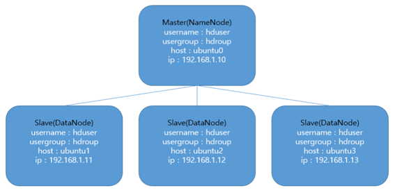
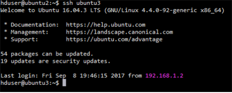
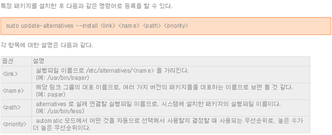
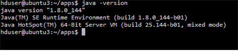
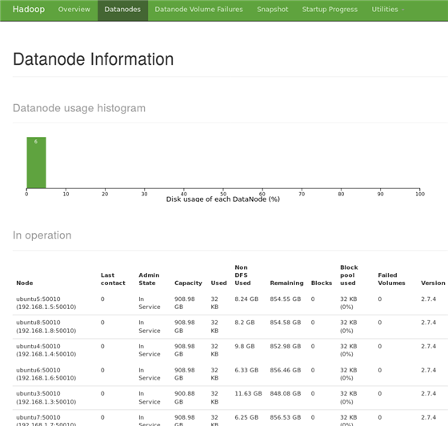
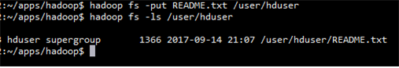
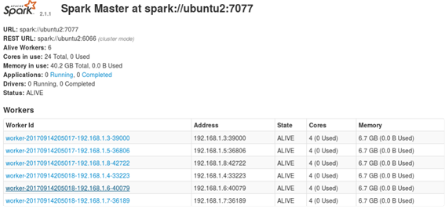

# how-to-setup-cluster



* 클러스터 환경이 위 그림과 같다고 가정하고 클러스터 세팅을 설명하겠습니다.(Slave의 대수에 따라 맞게 해주시면 되겠습니다.)
* Master, Slave 모든 서버에서 실행할 명령어는 (모든 서버에서) 수행하시면 됩니다.
* Master에서만 실행할 명령어는 (Master에서만 수행) 하시면 됩니다
* Slave에서만 실행할 명령어는 (Slave에서만 수행) 하시면 됩니다


## 서버 환경 구성

### 가. user/usergroup 생성(모든 서버에서 수행)

모든 서버에 hadoop 유저 그룹과 hduser 유저 생성

```{.bash}
sudo addgroup hadoop
sudo adduser --ingroup hadoop hduser
```

sudoers file에 hduser 추가(hduser에게 권한 부여)

```{.bash}
sudo visudo
-------------------------
hduser ALL=(ALL:ALL) ALL
```

hduser로 로그인
```{.bash}
su - hduser
```

### 나. hosts 파일 수정(모든 서버에서 수행)
분산 환경이기 때문에 4대의 서버 모두에 접속이 자유롭게 되어야 합니다. 이를 위해서 모든 서버들의 hosts 파일에 ip와 host 이름을 생성해 주도록 합니다. 참고로 여기서는 ubuntu0이 master 서버가 될 예정이고, 그외 서버들은 slave 서버가 될 예정입니다.

hosts 파일 수정
```{.bash}
$ sudo vi /etc/hosts
--------------------------------------------------------------------------
192.168.1.10    ubuntu0
192.168.1.11    ubuntu1
192.168.1.12    ubuntu2
192.168.1.13    ubuntu3
```

잘 변경 되었는지 확인
```
cat /etc/hosts
```

### 다. hostname 변경(모든 서버에서 수행)
각 4대 서버들의 이름을 나. 에서 지정한 host이름과 동일하게 맞춰주도록 합니다.

ubuntu0 서버의 경우
```
sudo vi /etc/hostname
--------------------------------------------------------------------------
ubuntu0
```

변경사항 적용하기(서버 재부팅 필요없음)
```
sudo /bin/hostname -F /etc/hostname
```

#### 라. ssh 설정(Master에서만 수행)
hadoop은 분산처리시에 서버들간에 ssh 통신을 자동적으로 수행하게 됩니다. 이를 위해 암호입력 없이 접속이 가능하도록 ubuntu0 서버에서 공개키를 생성하고 생성된 키를 각 서버들에 배포해줍니다.

ssh 설치
```
sudo apt-get install openssh-server
```

ssh 설정 변경(sshd_config 파일을 열고 아래 두 줄을 찾아서 수정)
```
sudo vi /etc/ssh/sshd_config
--------------------------------------------------------------------------
PubkeyAuthentication yes
AuthorizedKeysFile      .ssh/authorized_keys
```

공개키 생성
```
mkdir ~/.ssh
chmod 700 ~/.ssh
ssh-keygen -t rsa -P ""
cat ~/.ssh/id_rsa.pub >> ~/.ssh/authorized_keys
```

공개키를 각 서버에 배포
```
ssh-copy-id -i ~/.ssh/id_rsa.pub ubuntu1
ssh-copy-id -i ~/.ssh/id_rsa.pub ubuntu2
ssh-copy-id -i ~/.ssh/id_rsa.pub ubuntu3
```

접속 테스트
```
ssh ubuntu3
```



#### 마. JAVA 설치(모든 서버에서 수행)
Hadoop이 JVM을 사용하기 때문에 모든 서버에 java SDK를 설치하도록 합니다. 여기서는 현재 최신 버젼인 java 1.8을 설치하겠습니다.

java directory 생성
``` 
sudo mkdir /opt/jdkcd /opt
```

아래 링크에서 운영체제에 맞는 Java SE Development Kit (e.g. 8u144) 다운로드 <http://www.oracle.com/technetwork/java/javase/downloads/jdk8-downloads-2133151.html>

Java가 다운로드 된 경로로 가서 아래 명령어 수행
```
sudo tar -zxf jdk-8u144-linux-x64.tar.gz -C /opt/jdk
```

Update Ubuntu alternatives symbolic links
```
sudo update-alternatives --install /usr/bin/java java /opt/jdk/jdk1.8.0_144/bin/java 100
sudo update-alternatives --install /usr/bin/javac javac /opt/jdk/jdk1.8.0_144/bin/javac 100
```



설치 확인(버젼정보가 보여지면 정상적으로 설치가 잘 된 것입니다.)
```
java –version
```



## Hadoop 설치

#### 가. 디렉토리 생성

data 디렉토리 생성(모든 서버에서 수행)
```
sudo mkdir /data
sudo chown -R hduser:hadoop /data
```

hadoop, spark가 위치할 디렉토리 생성(모든 서버에서 수행)
```
cd ~
mkdir apps
```

namenode 디렉토리 생성(Master에서만 수행)
```
mkdir /data/tmp /data/namenode
```

datanode, userlogs 디렉토리 생성(Slave에서만 수행)
```
mkdir /data/tmp /data/datanode /data/userlogs
```

#### 나. hadoop 2.7.4 설치(Master에서만 수행)

아래 링크에서 hadoop 다운로드
<http://www.us.apache.org/dist/hadoop/common/hadoop-2.7.4/hadoop-2.7.4.tar.gz>

hadoop 파일이 존재하는 경로에서 아래 명령 수행

```
tar –zxf hadoop-2.7.4.tar.gz –C ~/apps
cd ~/apps
ln –s hadoop-2.7.4 hadoop
```

환경변수 설정: hadoop 디렉토리에 쉽게 접근할 수 있도록 환경변수를 설정해 줍니다.
```
vi~/.bashrc
--------------------------------------------------------------------------
# java
export JAVA_HOME=/opt/jdk/jdk1.8.0_144
export PATH=${JAVA_HOME}/bin:$PATH

# hadoop
export HADOOP_HOME=/home/hduser/apps/hadoop
export PATH=${HADOOP_HOME}/bin:${HADOOP_HOME}/sbin:$PATH
export HADOOP_CONF_DIR=${HADOOP_HOME}"/etc/hadoop"
```
hadoop 환경 설정: 해당 파일을 열고 JAVA_HOME 환경변수 선언 부분 수정
```
$ vi ~/apps/hadoop/etc/hadoop-env.sh
--------------------------------------------------------------------------
export JAVA_HOME=/opt/jdk/jdk1.8.0_144
```

#### 다. config 파일 설정(Mater에서만 수행)

hadoop과 관련된 config 파일 내용을 작성합니다.
```
vi ~/apps/hadoop/etc/hadoop
```

core-site.xml
```
vi core-site.xml
--------------------------------------------------------------------------
<configuration>
    <property>
        <name>fs.defaultFS</name>
        <value>hdfs://ubuntu0:9000</value>
    </property>
    <property>
        <name>hadoop.tmp.dir</name>
        <value>/data/tmp</value>
    </property>
</configuration>
```

hdfs-site.xml
```
vi hdfs-site.xml
--------------------------------------------------------------------------
<configuration>
    <property>
        <name>dfs.replication</name>
        <value>3</value>
    </property>
    <property>
        <name>dfs.namenode.name.dir</name>
        <value>/data/namenode</value>
    </property>
</configuration>
```

mapreduce-site.xml
```
vi mapred-site.xml
--------------------------------------------------------------------------
<configuration>
    <!-- MapReduce ApplicationMaster properties -->
    <property>
        <name>yarn.app.mapreduce.am.resource.mb</name>
        <value>1536</value>
    </property>
    <property>
        <name>yarn.app.mapreduce.am.command-opts</name>
        <value>-Xmx1536m</value>
    </property>

    <!-- Mappers and Reducers settings -->
    <property>
        <name>mapreduce.map.memory.mb</name>
        <value>2048</value>
    </property>
    <property>
        <name>mapreduce.map.cpu.vcores</name>
        <value>1</value>
    </property>
    <property>
        <name>mapreduce.reduce.memory.mb</name>
        <value>4096</value>
    </property>
    <property>
        <name>mapreduce.reduce.cpu.vcores</name>
        <value>1</value>
    </property>
    <property>
        <name>mapreduce.job.reduces</name>
        <value>2</value>
    </property>

    <!-- History Server settings -->
    <property>
        <name>mapreduce.jobhistory.address</name>
        <value>ubuntu0:10020</value>
    </property>
    <property>
        <name>mapreduce.jobhistory.webapp.address</name>
        <value>ubuntu0:19888</value>
    </property>
```

slaves
```
vi slaves
--------------------------------------------------------------------------
ubuntu1
ubuntu2
ubuntu3
```

hadoop-env.sh: JAVA_HOME 부분을 찾아 아래와 같이 수정
```
vi hadoop-env.sh
--------------------------------------------------------------------------
export JAVA_HOME=/opt/jdk/jdk1.8.0_144
```

#### 라. config 파일을 Slave 서버로 배포(Master에서만 수행)
다.에서 작성한 .bashrc 파일 및 hadoop 패키지를 다른 서버로 배포합니다. 개별적으로 설치하는 것 보다 시간을 단축시킬수 있어 편리합니다.
```
scp -r /home/hduser/.bashrc ubuntu1:/home/hduser/.bashrc
scp -r /home/hduser/.bashrc ubuntu2:/home/hduser/.bashrc
scp -r /home/hduser/.bashrc ubuntu3:/home/hduser/.bashrc

# 변경된 bashrc 파일 내용 반영(원격 명령어 수행)
ssh hduser@ubuntu1 'source ~/.bashrc'
ssh hduser@ubuntu2 'source ~/.bashrc'
ssh hduser@ubuntu3 'source ~/.bashrc'

scp -r /home/hduser/apps/hadoop ubuntu1:/home/hduser/hadoop
scp -r /home/hduser/apps/hadoop ubuntu2:/home/hduser/hadoop
scp -r /home/hduser/apps/hadoop ubuntu3:/home/hduser/hadoop
```

#### 마. config 파일 설정(Slave: ubuntu2 에서만 수행)
라.과정에서 마스터로부터 받은 hadoop패키지 설정파일을 slave에 맞게 변경합니다. slave에만 해당하는 설정 파일로 수정한 뒤 다른 ubuntu3, ubuntu4 slave로 전송합니다.

```
cd ~/apps/hadoop/etc/hadoop
```

hdfs-site.xml
```
vi hdfs-site.xml
----------------------------------------------------------------------------------
<configuration>
    <property>
        <name>dfs.datanode.data.dir</name>
        <value>/data/datanode</value>
    </property>
</configuration>
```

yarn-site.xml
```
yarn-site.xml
----------------------------------------------------------------------------------
<configuration>

    <property>
        <name>yarn.nodemanager.aux-services</name>
        <value>mapreduce_shuffle</value>
    </property>

    <!-- Link to the master node -->
    <property>
        <name>yarn.resourcemanager.hostname</name>
        <value>ubuntu0</value>
    </property>

    <!-- Available resources for YARN containers on this node -->
    <property>
        <name>yarn.nodemanager.resource.memory-mb</name>
        <value>7048</value>
    </property>
    <property>
        <name>yarn.nodemanager.resource.cpu-vcores</name>
        <value>2</value>
    </property>

    <property>
        <name>yarn.nodemanager.vmem-check-enabled</name>
        <value>false</value>
    </property>

    <!-- Log aggregation settings -->
    <property>
        <name>yarn.log-aggregation-enable</name>
        <value>true</value>
    </property>
    <property>
        <name>yarn.nodemanager.log-dirs</name>
        <value>/data/userlogs</value>
    </property>
    <property>
        <name>yarn.log.server.url</name>
        <value>ubuntu0:19888</value>
    </property>
    <property>
        <name>yarn.nodemanager.delete.debug-delay-sec</name>
        <value>86400</value>
    </property>

</configuration>
```

변경사항 동기화 전송
```
rsync -av /home/apps/hduser/hadoop/etc/hadoop ubuntu2:/home/hduser/hadoop/etc

rsync -av /home/apps/hduser/hadoop/etc/hadoop ubuntu3:/home/hduser/hadoop/etc
```

#### 바 HDFS 시작(Master에서만 수행)
설치가 모두 완료가 되었으니 이제 hdfs (파일시스템)을 기동합니다. namenode를 format 하고 hdfs 를 시작합니다. 

```
hadoop namenode -format myCluster

#서비스 시작
$ start-dfs.sh   

#서비스 종료
$ stop-dfs.sh    
```

web ui에서 Namenode 1개와 Datanode 3개가 잘 나타나면 정상 (http://ubuntu0:50070)



만약 이상이 있다면 각 서버별로 로그들을 확인
```
cd ~/apps/hadoop/logs
```

#### 사. 주의사항
초기 설치시에는 해당사항이 없지만 한번 서비스를 진행하다가 다시 namenode를 format 해야하는 일이 생기면, 반드시 먼저 datanode 하위 모든 파일을 삭제하고 진행을 해야 합니다. 

만약 하위 파일들을 삭제하지 않고 format을 하면 namenode의 clusterId와 datanode의 clusterId가 달라져서 정상적으로 동작하지 않을 수 있습니다.(참고 : <http://hadooptutorial.info/incompatible-clusterids/>)

#### 아. FileSystem 테스트(Master에서만 수행)
Hadoop 파일시스템에 디렉토리를 생성하고 테스트 파일(/opt/test.txt)을 업로딩 해봅니다.
```
hadoop fs -mkdir /user
hadoop fs -mkdir /user/hduser
cd ~/apps/hadoop
hadoop fs -put README.txt /user/hduser
hadoop fs -ls /user/hduser
```



자. history server 시작

application이 실행이 되면 그 수행 기록들이 history server에 남게 됩니다.

```
mr-jobhistory-daemon.sh start historyserver    #서비스 시작

mr-jobhistory-daemon.sh stop historyserver    #서비스 종료
```

web ui for history - <http://ubuntu0:19888>


#### 차. MapReduce 예제 실행(Master에서만 수행)
여기까지 잘 진행이 되었다면 설치가 모두 완료가 되었습니다. 정상적으로 동작하는지 테스트를 위해서 PI 값을 구하는 예제를 실행해봅니다.
```
yarn jar $HADOOP_HOME/share/hadoop/mapreduce/*examples*.jar pi 50 100
----------------------------------------------------------------------------------
# 결과 예시
Job Finished in 82.415 seconds
Estimated value of Pi is 3.14160000000000000000

# ResourceManager UI or History Server UI 에서 해당 log를 볼수있게됨(예시)
yarn logs --applicationId application_1482330106523_0001 > pi_app.log
```

## Spark 설치

#### Spark 다운로드(Master에서만 수행)
아래 링크로부터 spark 2.1.1을 다운로드 합니다.(다른 버전은 두번째 링크에서 다운로드 가능)

<https://d3kbcqa49mib13.cloudfront.net/spark-2.1.1-bin-hadoop2.7.tgz>

<https://spark.apache.org/downloads.html>

다운로드 받은 파일을 ~/apps경로에 압축 해제 및 심볼릭 링크 생성(위의 2. Hadoop 설치의 과정을 보면 됩니다.)

환경변수 설정: spark 디렉토리에 쉽게 접근할 수 있도록 환경변수를 설정해 줍니다.
```vi ~/.bashrc
--------------------------------------------------------------------------
export YARN_CONF_DIR=${HADOOP_HOME}/etc/hadoop
# spark
export SPARK_HOME=/home/hduser/apps/spark
export PATH=${SPARK_HOME}/bin:$PATH
```

#### 나. Spark in Standalone(Master에서만 진행)
park cluster를 셋업합니다.

spark 디렉토리를 모든 slave에 배포
```
scp -r /home/hduser/apps/spark ubuntu1:/home/hduser/apps/spark
scp -r /home/hduser/apps/spark ubuntu1:/home/hduser/apps/spark
scp -r /home/hduser/apps/spark ubuntu1:/home/hduser/apps/spark
```

하위 slave를 등록
```
vi ~/apps/spark/conf/slaves
--------------------------------------------------------------------------
ubuntu1
ubuntu2
ubuntu3
```

spark 환경 설정(JAVA_HOME을 명시해줍니다)
```
vi ~/apps/spark/conf/spark-env.sh
--------------------------------------------------------------------------
JAVA_HOME=/opt/jdk/jdk1.8.0_144
```

서비스 시작/종료
```
. ~/apps/spark/sbin/start-all.sh
. ~/apps/spark/sbin/stop-all.sh
```

web ui로 확인 가능 : http://ubuntu0:8080



테스트(아래 명령어 수행), 예제가 잘 수행되면 정상적으로 설치 및 설정이 된 것입니다.web ui에서 해당 application들이 수행되는 모습을 모니터링 할 수 있으며, 결과와 로그도 볼 수 있습니다.(Pi의 값을 구하는 예제)
```
spark-submit \
   --master spark://ubuntu0:7077 \
   --class org.apache.spark.examples.SparkPi \
   ~/apps/spark/examples/jars/spark-examples*.jar \
   100
```

추가) ~/apps/spark/conf/spark-env.sh 에 SPARK_WORKER_MEMORY=2g 라인 추가

#### 다. Spark history server
Spark에서 제공하는 history server를 띄워보겠습니다. 디폴트 UI port는 18080입니다.
```
hadoop fs -mkdir -p /user/hduser/spark/history

sudo vi ~/spark/conf/spark-defaults.conf
--------------------------------------------------------------------------
park.master                    spark://ubuntu0:7077
spark.eventLog.enabled         true
spark.eventLog.dir              hdfs://ubuntu0:9000/user/hduser/apps/spark/history
spark.history.fs.logDirectory    hdfs://ubuntu0:9000/user/hduser/apps/spark/history
spark.history.provider          org.apache.spark.deploy.history.FsHistoryProvider

~/apps/spark/sbin/start-history-server.sh
```

# Reference & Acknowledgements
http://hadoop.apache.org/
http://daeson.tistory.com/277
https://www.tutorialspoint.com/hadoop
